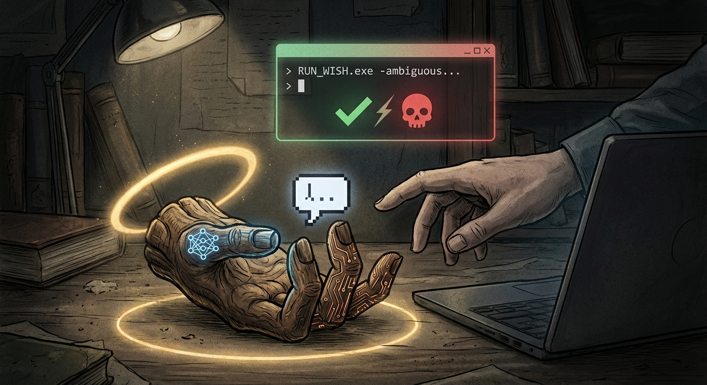

This started as a silly thought. The kind of thing that pops into your head between meetings and refuses to leave. But the more I sat with it, the more I realised the silly thought was hiding something genuinely useful underneath.

So let's talk about metaphors. Specifically, the metaphors we use to talk about LLMs and AI agents, and how those metaphors are actively making people worse at using these tools.

## The Metaphor Problem

We've collectively settled on a set of comforting comparisons for LLMs. They're a "junior developer." A "copilot." An "exoskeleton." A "force multiplier." These labels come from smart people with good intentions, and they're not entirely wrong. But they carry a set of assumptions that, I'd argue, are doing more harm than good.

Think about what you expect from a junior developer. Someone who might lack experience, sure, but who understands the goal, shares your professional context, and is actively trying to do good work. You expect them to ask clarifying questions when things are ambiguous. You expect them to flag when something feels off. You expect a baseline of professional intent.

Now think about what actually happens when you give an LLM a loosely-defined task. It doesn't ask for clarification, it fills every gap with confident improvisation. It doesn't flag ambiguity it resolves it silently, in whatever direction the probability distribution takes it. It doesn't share your understanding of "good enough", it has no understanding at all, only patterns and statistical completion.

And then we act surprised when the output goes sideways.

The spec-driven engineering movement that's been gaining momentum in the AI-assisted development world gets closer to the right mental model. If you define your requirements precisely, you get better results. That much is obvious. But it frames the issue purely in software engineering terms, and the vast majority of people using LLMs are not software engineers writing formal specifications. They're marketers, managers, students, founders, writers. They're "vibing", as the kids say.

For these people (and for plenty of engineers too), the "junior developer" label creates a dangerous mismatch between expectations and reality.

## A Better Metaphor: The Monkey Paw

So here's my proposal, and I'm only partly joking: we should stop calling LLMs copilots and start calling them what they actually behave like. **Monkey Paws.** Genies. Djinn. Pick your preferred folklore.

If you're not familiar with the reference, W.W. Jacobs wrote "The Monkey's Paw" in 1902. The premise is simple: a magical artifact grants you wishes, but every wish is fulfilled in the most literal, often catastrophic way possible. You get exactly what you asked for, never what you meant.

That, right there, is the LLM experience in a nutshell.

## It Goes Deeper Than "Be Careful What You Wish For"

Now, the easy reading of the Monkey Paw metaphor is just "be specific with your prompts." That's true but shallow. The folklore tradition around wish-granting entities (djinn, genies, fae bargains, monkey paws) is really about something more fundamental: **the danger of delegation without understanding.**

In every one of these stories, the person making the wish doesn't fully understand the system they're interacting with. They assume shared context that doesn't exist. They assume benevolent interpretation of ambiguity. They assume the entity granting the wish cares about the spirit of the request, not just the letter.

Sound familiar?

This maps perfectly onto what I see happening with LLM adoption, especially in the "vibe coding" era. People are delegating tasks they cannot evaluate to systems they do not understand, and then trusting the output because it looks professional. The code compiles. The text reads well. The analysis sounds confident. But none of that means it's correct, and the person asking often lacks the expertise to tell the difference.

There's a principle in software engineering known as Chesterton's Fence: before you remove a fence, understand why it was put there. The LLM equivalent is: before you automate a task, understand what the task actually requires. Otherwise, you're making wishes without understanding the cost.

The examples write themselves, and many of them have actually happened:

- "Build me something great" without a secured sandbox? Enjoy your `rm -rf ~/`.
- "Just make it work" on repeat without reading the plan? Congratulations, your API keys are now public on GitHub.
- "Refactor this codebase" with no constraints? Hope you were attached to that architecture, because it's gone.
- "Write me a contract summary" without specifying jurisdiction or key terms? The output reads beautifully and is legally meaningless.

These aren't hypotheticals. They're Tuesday. And they keep happening because the "junior developer" mental model suggests a collaborator who's trying to help, not a wish-granting entity that operates on token probabilities and couldn't care less about your production database.

## The Escalation Ladder

If you accept the Monkey Paw framing, something useful falls out of it: a natural escalation model for how careful you need to be.

Think of it this way. In folklore, there's a spectrum of wish-granting interactions, and each level demands a corresponding level of precision from the person making the request.

At the simplest level, you have the **casual wish**. "Hey genie, can you tidy up this room?" Low stakes, limited scope, easy to verify. This is your basic chat completion: you ask Claude to rewrite a paragraph, you read the output, you're done. The Monkey Paw can't hurt you much here because the blast radius is tiny and you're looking at the result.

Then you have the **formal wish**. "I wish for wealth." The scope is broader, the interpretation space is wider, and the consequences are harder to reverse. This maps to using an agent to complete a multi-step task: research a topic, draft a document, update a spreadsheet. You need to define success criteria. You need guardrails. You need to check the intermediate steps, not just the final output.

And at the top, the **binding contract**. "I wish for immortality." Maximum autonomy, maximum ambiguity, maximum potential for catastrophic misinterpretation. This is the autonomous agent with access to your systems: your codebase, your email, your deployment pipeline. This is where the Monkey Paw can truly grant your wish in a way that ruins your life.

The principle is straightforward: **the more autonomy you grant, the tighter your specification needs to be.** But it's the opposite of what people naturally do. People tend to be most careful with small, manual tasks (where the risk is low) and most casual with delegated, automated ones (where the risk is high). The Monkey Paw framing corrects this by putting you in the right mindset: greater power demands greater precision.

A simple heuristic:

- **Chat completion** → Read the output. You are the guardrail.
- **Multi-step agent** → Define success criteria. Check intermediate results. Constrain the scope.
- **Autonomous agent with system access** → Sandbox everything. Treat every instruction as a legal contract. Assume literal, adversarial interpretation of every ambiguity.

## The Organisational Dimension

Here's where this stops being a fun metaphor and starts having real consequences: the mental model you adopt shapes the decisions you make.

Companies that frame LLMs as "copilots" make different organisational decisions than companies that frame them as Monkey Paws. The copilot framing suggests a trusted assistant that augments human capability. It implies safety. It implies professional behaviour. It implies that you can relax your guard a little because the system is "on your side."

This framing leads to decisions like: deploy broadly, iterate later. Give agents access to production systems so they're "more useful." Let non-technical staff use AI tools without training because "it's just like talking to a smart colleague." Skip the sandbox because "it's just a copilot, what's the worst that could happen?"

The Monkey Paw framing leads to very different decisions. It says: this tool is powerful and will do exactly what you ask, which is precisely why you need guardrails. It says: every ambiguity in your request is a vector for unintended consequences. It says: the more powerful the tool, the more important the governance around it.

That second set of decisions produces better outcomes. Not because LLMs are dangerous (they're tools, and tools are neither safe nor dangerous in isolation), but because the Monkey Paw framing puts humans in the right posture: attentive, precise, and never assuming benevolent interpretation of sloppy instructions.

From a practical standpoint, this means things like: proper sandboxing for any agent with system access, tiered access based on task complexity, mandatory review processes for high-stakes outputs, and training that emphasises specification quality rather than just "prompt engineering tips." It also means that procurement and security reviews should ask different questions. Not "how smart is this AI?" but "what happens when the specification is incomplete?"

## So, Is This Just About Better Prompting?

Partly, yes. But the deeper point is about mental models. The words we use to describe tools shape how we use them. Call it a copilot, and people relax. Call it a Monkey Paw, and people think twice.

A junior developer wants to do a good job. A Monkey Paw just wants to close the ticket.

I know which mental model I'd rather have people carry when they're handing an AI agent the keys to their infrastructure.

That said, let me be clear: I'm not arguing against using LLMs. I use them extensively, and they've meaningfully changed how I work. I'm arguing for using them with the right expectations. The magic is real. The wishes do get granted. But every gap in your specification is an invitation for the universe to get creative, and token probability distributions are nothing if not creative.

Be precise. Be cautious. Verify everything. And never, ever assume benevolent interpretation of ambiguity.
